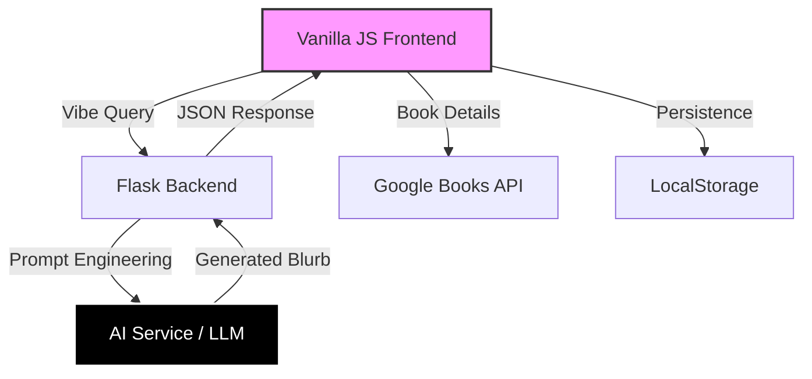

# BiblioDrift 📚☕
[](https://gitcanvas-dm.streamlit.app/)

> **"Find yourself in the pages."**

BiblioDrift is a cozy, visual-first book discovery platform designed to make finding your next read feel like wandering through a warm, quiet bookstore rather than scrolling through a database.

## Open Source Events Navigation

[](Open-Source-Event-Guidelines.md)

## 🌟 Core Philosophy
- **"Zero UI Noise"**: No popups, no aggressive metrics. Just calm browsing.
- **Tactile Interaction**: 3D books that you can pull from the shelf and flip over.
- **Vibe-First**: Search for feelings ("rainy mystery"), not just keywords.

## 🚀 Features (MVP & Roadmap)
- **Interactive 3D Books**: Hover to pull, click to flip and **expand**.
- **Virtual Library**: Realistic wooden shelves to save your "Want to Read", "Currently Reading", and "Favorites" list (Persistent via LocalStorage).
- **Glassmorphism UI**: A soothing, modern interface that floats above the content.
- **AI-Powered Recommendations** (Planned): All book recommendations must be generated exclusively by AI.  
     No manual curation, static lists, or hardcoded recommendations are permitted.
- **Dynamic Popups**: Click a book to see an expanded view with AI-generated blurbs.
- **Curated Tables**: Horizontal scrolling lists based on moods like "Monsoon Reads".

## 🛠️ Tech Stack

<div align="center">
<table style="border: none; border-collapse: collapse;">
<tr>
<td align="center"><b>Frontend</b>


<code>Vanilla JS</code> • <code>CSS3 3D</code> • <code>HTML5</code></td>
<td align="center"><b>API & Data</b>


<code>Google Books API</code> • <code>LocalStorage</code></td>
<td align="center"><b>Backend & AI</b>


<code>Python Flask</code> • <code>FAISS / LLM</code></td>
</tr>
</table>
</div>

## System Architecture
To maintain our strict AI-driven model, BiblioDrift utilizes a decoupled flow where the backend acts as the "Curator" and the frontend acts as the "Librarian."


## 🤖 Project Structure 
```
BIBLIODRIFT/
├── __pycache__/          # Python cache files
├── assets/               # Images, icons, and static UI assets
├── instance/             # App instance / runtime files
├── mood_analysis/        # Mood & emotion analysis logic
├── purchase_links/       # Book purchase / external links logic
├── script/               # Utility or helper scripts
├── venv/                 # Python virtual environment
│
├── .env.example          # Environment variables template
├── .gitignore
│
├── ai_service.py         # AI-powered recommendation / analysis service
├── app.py                # Main backend application entry point
├── models.py             # Database / data models
├── requirements.txt      # Python dependencies
│
├── app.js                # Frontend JavaScript logic
├── chat.js               # Chat interaction logic
├── library-3d.js         # 3D library visualization logic
│
├── index.html            # Landing / discovery page
├── auth.html             # Authentication (Sign In / Sign Up)
├── chat.html             # Chat interface
├── library.html          # User’s virtual library page
│
├── style.css             # Main stylesheet
├── style-original.backup # Backup of original styles
│
├── CONTRIBUTING.md       # Contribution guidelines
├── LICENSE
├── README.md             # Project documentation
├── CONTRIBUTING.md       # Contribution guide and setup notes
├── PROJECT_DETAILS.md    # Contributor-facing project guide
└── page.png              # Preview / UI reference image
```
## 🤖 AI Recommendation Policy

BiblioDrift follows a **strict AI-only recommendation model**.

- All recommendations must be generated dynamically using AI/LLMs.
- Manual curation, editor picks, static mood lists, or hardcoded book mappings are **not allowed**.
- AI outputs should be based on abstract signals such as:
  - Vibes
  - Mood descriptors
  - Emotional tone
  - Reader intent

This ensures discovery stays organic, scalable, and aligned with BiblioDrift’s philosophy of vibe-first exploration.

## 📦 Installation & Setup

### Frontend (Current MVP)
1. Clone the repository:
   ```bash
   git clone https://github.com/devanshi14malhotra/bibliodrift.git
   ```
2. Open `index.html` in your browser.
   - That's it! No build steps required for the vanilla frontend.

### Backend (Future)
Planned implementation using Python Flask.

##  Screenshots

<div align="center">
  <h3>Discovery & Virtual Library</h3>
  
  <br><br>
  
  
  <p><i>Capturing the tactile, vibe-first essence of BiblioDrift.</i></p>
</div>

## 🧠 AI Service Integration
To keep the frontend and backend synced, use the following mapping:

| Feature | Frontend Call (`app.js`) | API Endpoint (`app.py`) | Logic Provider (`ai_service.py`) |
| :--- | :--- | :--- | :--- |
| **Book Vibe** | `POST /api/v1/generate-note` | `handle_generate_note()` | `generate_book_note()` |

### API Integration
- **Endpoint**: `POST /api/v1/generate-note`
- **Logic**: Processed by `ai_service.py`

## 🤝 Contributing
We welcome contributions to make BiblioDrift cozier!

1. Fork the repo.
2. Create a feature branch such as `feature/cozy-mode`.
3. Make your changes and test them locally.
4. Push your branch and open a Pull Request.

See [CONTRIBUTING.md](CONTRIBUTING.md) for the fuller workflow and contribution rules.

## 📄 License
MIT License.

---
*Built by Devanshi Malhotra and contributors, with ☕ and code.*


```bash
If you like this project, please consider giving the repository a ⭐ STAR ⭐.
```
